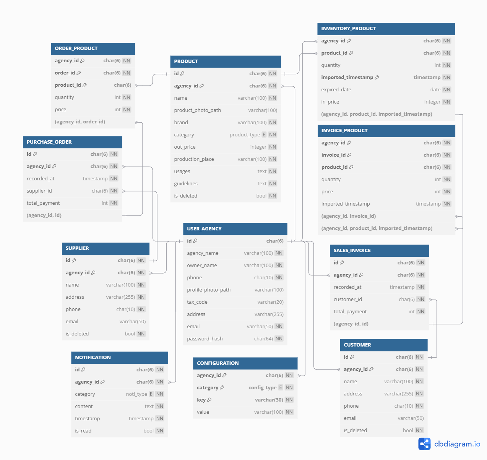

# Agricultural Supplies Management System
A system to manage inventory, orders, and sales for agricultural supply agencies.

## Features
- **Product Management**: Track products, prices, quantities, and categories.
- **Purchase Orders**: Manage orders with suppliers, including prices and timestamps.
- **Sales Invoices**: Track sales made to customers, including total payments and quantities sold.
- **Notifications**: Inform users about updates or important events.
- **Configurations**: Customize settings for each agency.
- **User Management**: Handle suppliers, customers, and user agencies.

## Technology Stack

### Backend
- **Node.js**: JavaScript runtime environment.
- **Express.js**: Web framework for building RESTful APIs.
- **PostgreSQL**: Database for storing application data.

## ER Diagram

